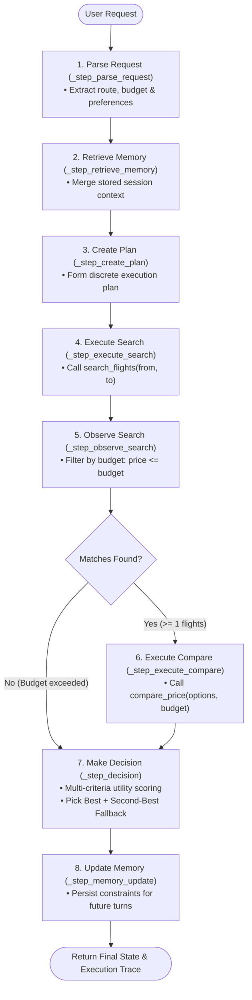
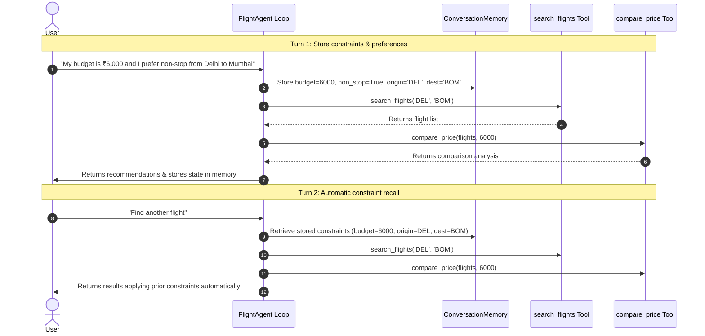

# ✈️ Flight Option Finder — Agentic AI Travel Assistant (CSE476)

[](https://python.org)
[](https://pytest.org)
[]()
[](LICENSE)

The **Flight Option Finder** is an AI **agent** (not a chatbot) that finds, evaluates, and selects flights within a user's budget. It implements a genuine **PLAN → ACT → OBSERVE → DECIDE** autonomous loop: given a natural-language goal like *"Find a non-stop flight from Delhi to Mumbai under ₹6,000"*, the agent retrieves stored memory, parses the request, creates an execution plan, calls `search_flights(from, to)` to discover available flights, observes results and applies budget filtering, calls `compare_price(options, budget)` to rank and compare candidates, and runs a multi-criteria decision engine that scores each flight by price, non-stop status, and time preference. It always provides a **primary recommendation** and a **second-best fallback**. The entire multi-step trace is recorded so every decision is transparent and explainable.

---

## 🏛️ System Architecture

### Agent Decision Loop & State Machine Flow



---

### Multi-Turn Context Persistence Sequence



---

## 🛠️ Tools and Memory

The agent uses two working computational tools:
1. **`search_flights(from_city, to_city)`**: Searches a local flight dataset (`data/flights.json`) and returns structured flight dictionaries with airline, price, stops, and schedule.
2. **`compare_price(options, budget)`**: Sorts flights by price, identifies the cheapest and second-best options, separates under-budget from over-budget flights, and isolates non-stop flights within budget.

**Memory** (`ConversationMemory`) persists across multiple turns within the same session. It stores the user's budget, origin, destination, non-stop preference, and time-of-day preference. When the user initiates a follow-up turn, the agent reads memory, retrieves stored constraints, and uses them without requiring the user to repeat anything.

---

## 🛡️ Honest Failure & Resilience

During development, `compare_price` crashed with a `TypeError` when `search_flights` returned an empty list for an unknown route and the agent passed the empty list to comparison without checking. 

**The Fix was two-fold:**
1. `compare_price` now validates its input and returns a structured "no options available" response instead of crashing.
2. The agent's `observe_search` step detects an empty result set and skips comparison entirely, transitioning directly to the decision step which reports honestly that no flights exist for the route with gap-to-budget analysis.

---

## 🚀 Running the Project

```bash
# Install dependencies
pip install -r requirements.txt

# Run tests (57 tests passing)
python -m pytest tests/ -v

# Run notebook demo
jupyter notebook notebooks/flight_option_finder_demo.ipynb
```

---

## 📂 Project Structure

```
CSE476/
├── README.md
├── requirements.txt
├── .env.example
├── .gitignore
├── data/
│   └── flights.json            # 23 flights across 7 routes
├── src/
│   ├── agent/
│   │   ├── flight_agent.py     # Core agent with plan-act loop
│   │   ├── state.py            # AgentState + structured trace
│   │   ├── memory.py           # ConversationMemory (persists across turns)
│   │   └── planner.py          # NLP intent parser
│   ├── tools/
│   │   ├── search_flights.py   # Tool 1: search_flights(from, to)
│   │   └── compare_price.py    # Tool 2: compare_price(options, budget)
│   ├── models/
│   │   └── flight.py           # Flight dataclass
│   └── config.py
├── tests/
│   ├── test_search_flights.py
│   ├── test_compare_price.py
│   ├── test_memory.py
│   └── test_agent.py
└── notebooks/
    └── flight_option_finder_demo.ipynb  # 3 scenarios
```

---

## 🎓 Viva & Technical Defense Reference

| Question | Where to find it |
| :--- | :--- |
| **Where is the plan-act loop?** | `src/agent/flight_agent.py` → `run()` method (while loop with state transitions) |
| **Where does the agent decide the next step?** | Each `_step_*` method sets `state.current_step` based on observations |
| **Where are tool calls?** | `_step_execute_search` → `search_flights()`, `_step_execute_compare` → `compare_price()` |
| **Where is memory written?** | `_step_memory_update` writes to `self.memory` |
| **Where is memory read?** | `_step_retrieve_memory` reads from `self.memory` and applies to state |
| **How do tool results influence decisions?** | `_step_observe_search` filters by budget; `_step_decision` scores by price + preferences |
| **How are failures handled?** | Empty results → skip compare → report honestly with closest fallback |

---

## 📄 License

Distributed under the [MIT License](LICENSE).
